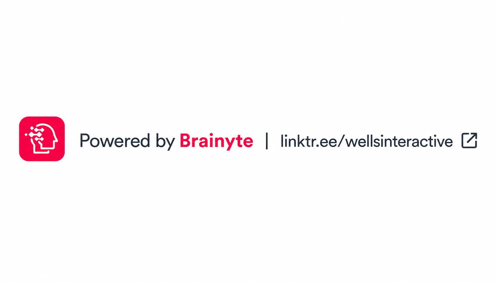
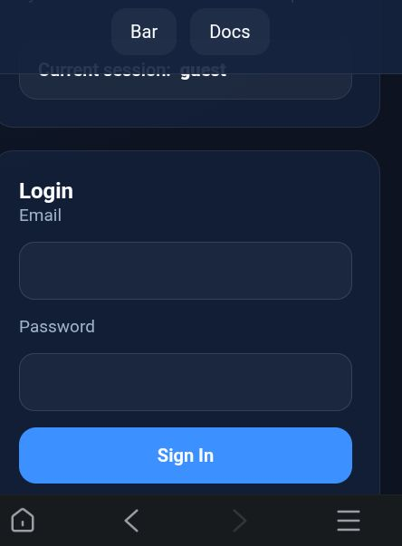
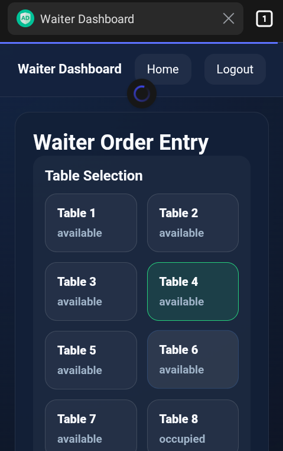
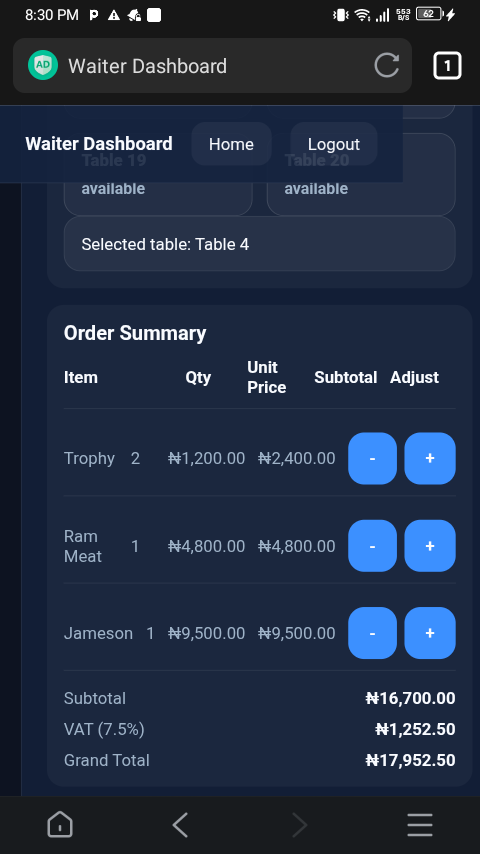
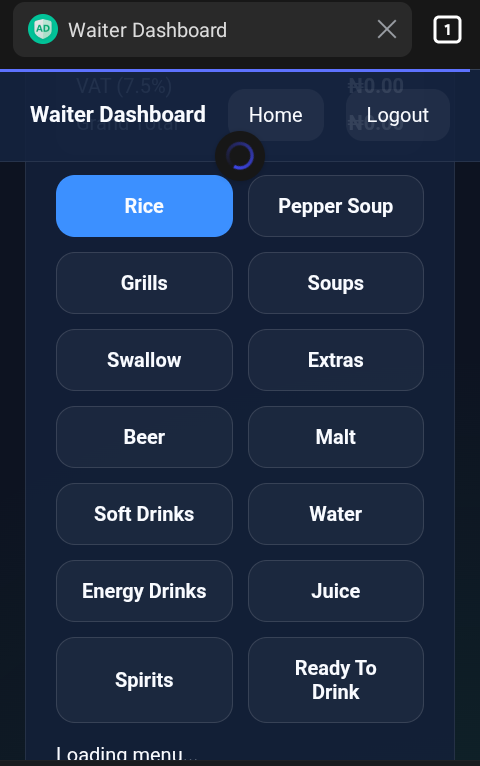
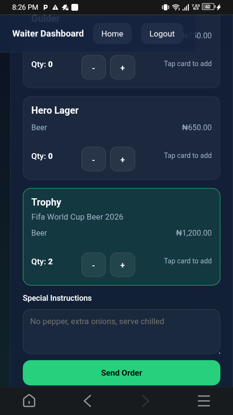
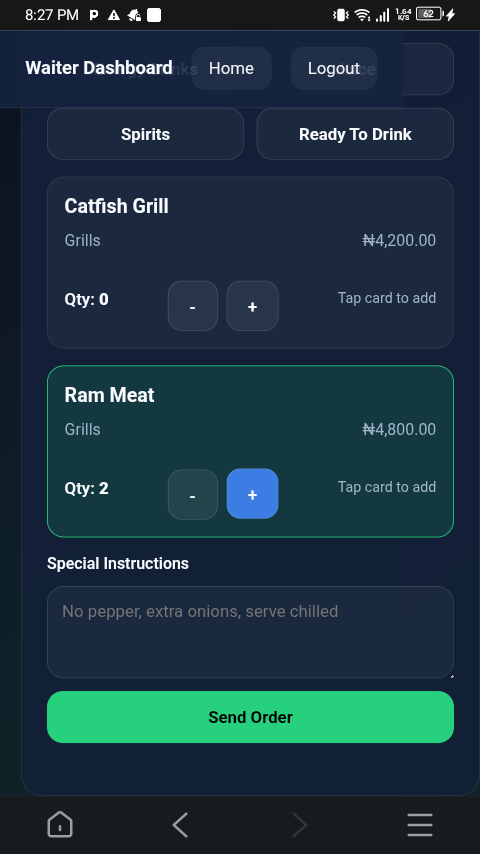
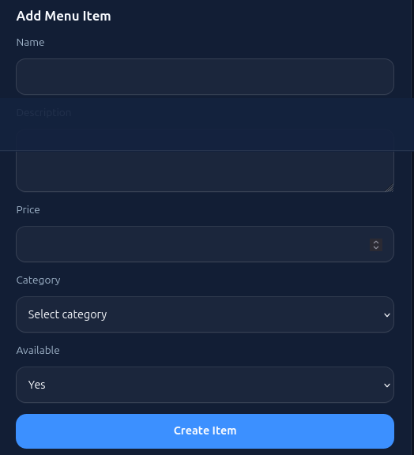
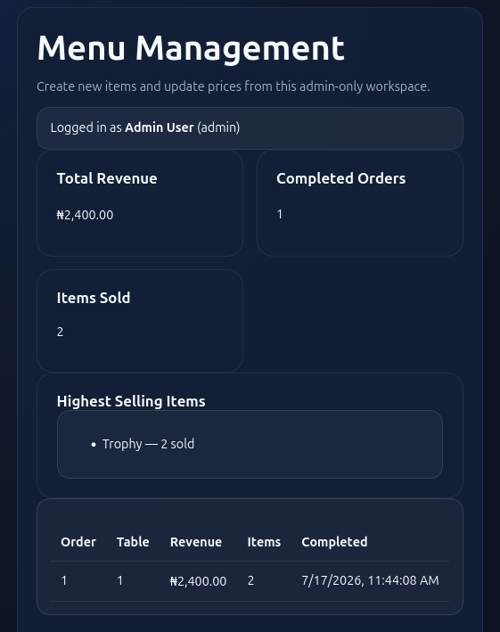

<div align="center">



# 🍽️ Brainyte Restaurant POS

### Modern Restaurant Point of Sale System for Nigerian Restaurants & Bars


**Designed & Developed by Brainyte**

https://linktr.ee/wellsinteractive

</div>

---

# 📖 Overview

Brainyte Restaurant POS is a modern restaurant ordering system built specifically for Nigerian restaurants, bars, lounges and hotels.

The system focuses on speed, simplicity and real-time communication between waiters, the kitchen and the bar.

Unlike traditional POS systems filled with unnecessary modules, Brainyte Restaurant POS is designed around fast order taking. Orders from Waiter to Kitchen is Instantenous, more like in milliseconds.

---

# 📱 Current Screens

<div align="center">

| Login | Tables | Order Confirm | Summary |
|:------:|:------:|:----:|:-----:|
|  |  |  |  |

| Kitchen | Beer | Grill | Water |
|:--------:|:---:|:------------:|:---------:|
|  |  |  |  |

| Admin Add | Admin Dash | Admin Item | Admin Price |
|:--------:|:---:|:------------:|:---------:|
 |  |  |  |


</div>

# ✨ Features

## 🔐 Authentication

- Login System
- Secure Sessions
- Logout
- User Roles

---

## 🍽️ Waiter Module

- ✅ 20 Restaurant Tables
- ✅ Live Table Status
- ✅ Order Entry
- ✅ Running Order Summary
- ✅ Quantity Increase/Decrease
- ✅ Nigerian Currency (₦)
- ✅ Customer Instructions
- ✅ Order Confirmation
- ✅ One-click Send Order

---

## 🍺 Drinks Menu
All Nigerian Drinks menu but can be customized for other countries.
---

## 🍲 Food Menu
All Nigerian food menu but can be customized for other countries.

# 🍳 Kitchen Module

- Incoming Orders
- Preparing Orders
- Ready Orders
- Live Updates

---

# 🍺 Bar Module

- Incoming Orders
- Preparing Drinks
- Ready Drinks
- Live Updates

---

# ⚡ API

REST API

- Login
- Menu
- Orders
- Status
- Live Events

---

# 💵 Currency

✔ Nigerian Naira (₦)

---

# 🧾 VAT

Current Version

VAT Rate

```
0%
```

(The VAT engine remains available internally and can easily be re-enabled.)

---

# 🎯 Current Status

| Module | Status |
|---------|--------|
| Login | ✅ Complete |
| Waiter | ✅ Complete |
| Tables | ✅ Complete |
| Menu | ✅ Complete |
| Order Summary | ✅ Complete |
| Confirmation Dialog | ✅ Complete |
| Customer Instructions | ✅ Complete |
| Kitchen Dashboard | ✅ Working |
| Bar Dashboard | ✅ Working |
| Branding | ✅ Complete |
| Responsive Layout | ✅ Complete |
| API | ✅ Complete |

---

# 🚀 Roadmap

## ✅ Phase 1

Web Version

- Login
- Waiter
- Kitchen
- Bar
- Orders
- API

**Status:** ✔ Completed

---

## 🟡 Phase 2

Testing & Bug Fixes

- Performance Improvements
- UI Polish
- Final Testing
- Security Review

**Current Stage**

---

## 📱 Phase 3

Android App

Planned Features

- Native Flutter App
- Push Notifications
- Offline Mode
- Live Kitchen Updates
- Live Bar Updates

---

## 🍎 Phase 4

iOS App

- Native Flutter
- App Store Release
- iPhone Optimized
- iPad Support

---

## ☁ Phase 5

Cloud Edition

- Multi-Branch
- Multi-Countries
- Multi-Currency
- Payments and Billings
- Online Dashboard
- Analytics
- Reporting
- Remote Management

---

# 🛠 Technology Stack

- PHP 8
- MySQL
- JavaScript (ES6)
- HTML5
- CSS3
- REST API

Future

- Firebase Push Notifications

---

# 📂 Project Structure

```
Restaurant POS

├── Login
├── Waiter
├── Kitchen
├── Bar
├── API
│
├── Assets
├── CSS
├── JS
└── Database
```

---

# ❤️ Branding

Powered by

**Brainyte**

https://linktr.ee/wellsinteractive

---

# 📌 Version

```
Brainyte Restaurant POS

Current Version 1.1 Stable
```

---

<div align="center">

## ⭐ Future Vision

🌐 Web Platform

⬇

📱 Android

⬇

🍎 iOS

⬇

☁ Cloud Restaurant Management Platform

---

Made by **Brainyte**

</div>
