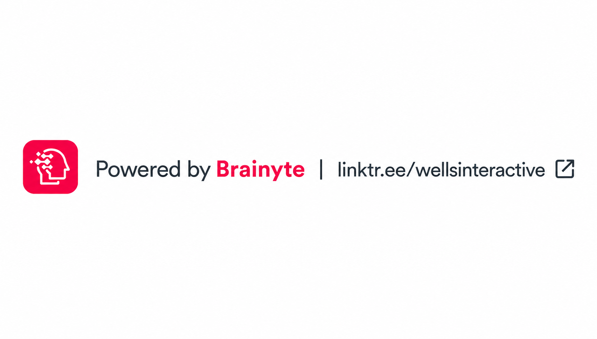
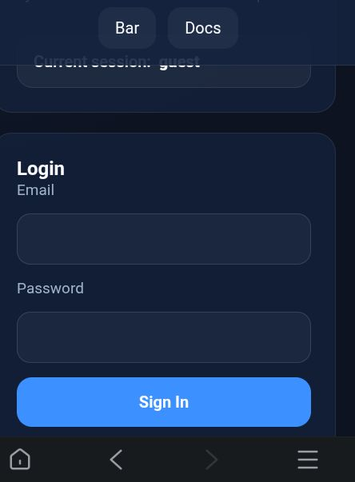
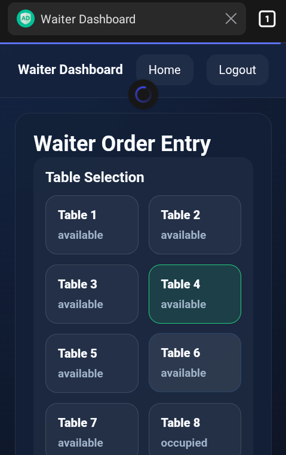
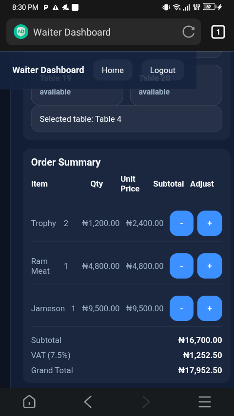
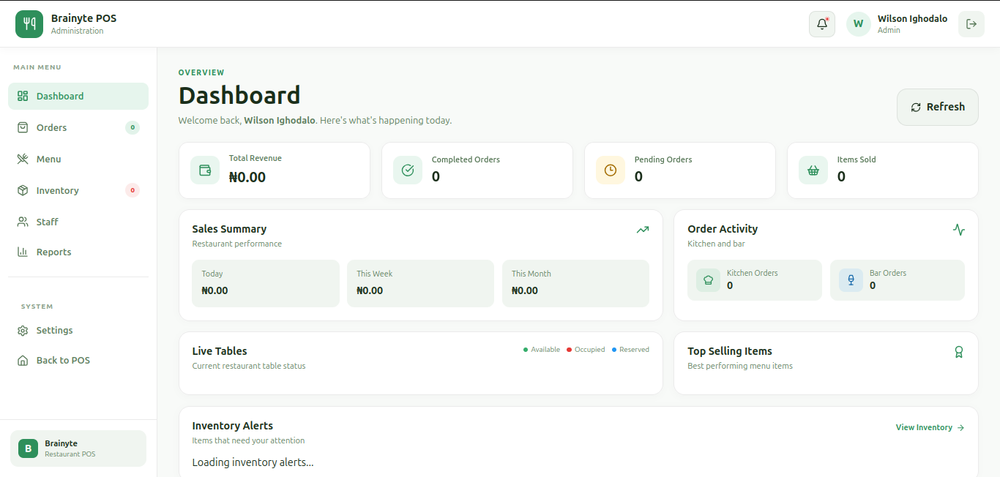

<div align="center">



# 🍽️ Brainyte Restaurant POS

### Modern Restaurant Point of Sale System for Nigerian Restaurants & Bars


**Designed & Developed by Brainyte**

https://linktr.ee/wellsinteractive

</div>

---

# 📖 Overview

Brainyte Restaurant POS is a modern restaurant ordering system built specifically for Nigerian restaurants, bars, lounges and hotels.
The system focuses on speed, simplicity and real-time communication between waiters, the kitchen and the bar.
Unlike traditional POS systems filled with unnecessary modules, Brainyte Restaurant POS is designed around fast order taking. Orders from Waiter to Kitchen is instantenous, more like in milliseconds.

---

# 📱 Current Screens

<div align="center">

| Login | Tables | Order Confirm | Summary |
|:------:|:------:|:----:|:-----:|
|  |  |  |  |


| Admin Dashboard



</div>

# Architecture
 
                BRAINYTE POS BACKEND
                 PHP + MySQL + REST API
                         │
          ┌──────────────┼──────────────┐
          │              │              │
          ▼              ▼              ▼
     Admin Web       Flutter App     REST API
     Browser         Android/iOS     Authentication
          │              │              │
          │       ┌──────┴──────┐       │
          │       │             │       │
          │    Waiter       Kitchen/Bar │
          │       │             │       │
          └───────┴─────────────┴───────┘
# ✨ Features

## 🔐 Authentication
✅ Login System
✅ Secure Sessions
✅  User Roles

## 📦 Inventory Management
✅ Inventory tracking per menu item
✅ Current stock levels
✅ Minimum stock levels
✅ Stock units
✅ Stock In
✅ Stock Out
✅ Manual stock adjustments
✅ Adjustment reasons and audit trail
✅ Inventory movement history
✅ Low-stock alerts
✅ Out-of-stock alerts
✅ Automatic menu availability based on stock
✅ Automatic stock deduction when orders are completed
✅ Inventory dashboard statistics

## 📊 Reporting
✅ Dashboard reporting
✅ Revenue reporting
✅ Completed order reporting
✅ Order and operational statistics
✅ Payment reporting
✅ Operations reporting
✅ Best-selling item reporting
✅ Table status reporting
✅ Date-range based reporting

---

## 🍽️ Waiter Module

- ✅ 20 Restaurant Tables
- ✅ Live Table Status
- ✅ Order Entry
- ✅ Running Order Summary
- ✅ Quantity Increase/Decrease
- ✅ Nigerian Currency (₦)
- ✅ Customer Instructions
- ✅ Order Confirmation
- ✅ One-click Send Order

---

## 🍺 Drinks Menu
All Nigerian Drinks menu but can be customized for other countries.
---

## 🍲 Food Menu
All Nigerian food menu but can be customized for other countries.

# 🍳 Kitchen Module

- Incoming Orders
- Preparing Orders
- Ready Orders
- Live Updates

---

# 🍺 Bar Module

- Incoming Orders
- Preparing Drinks
- Ready Drinks
- Live Updates

---

# ⚡ API

REST API

- Login
- Menu
- Orders
- Status
- Live Events
- Inventory
- Inventory Alerts
- Reports
- Notifications
- Settings
- Print Jobs
- Operations
- Suppliers
- Stock Receiving
- Order Cancellation
- Push Notification Subscription
- Table Close Evidence
- Bearer Authentication
- Token Refresh
- Token Revocation
---

# 💵 Currency

✔ Nigerian Naira (₦)

---


# 🧾 VAT

Current Version

VAT Rate

```
0%
```

(The VAT engine remains available internally and can easily be re-enabled.)

---

# 🎯 Current Status

| Module | Status |
|---------|--------|
| Login | ✅ Complete |
| Waiter | ✅ Complete |
| Admin | ✅ Complete |
| Owner | ✅ Complete |
| Manager | ✅ Complete |
| Tables | ✅ Complete |
| Menu | ✅ Complete |
| Order Summary | ✅ Complete |
| Confirmation Dialog | ✅ Complete |
| Customer Instructions | ✅ Complete |
| Kitchen Dashboard | ✅ Complete |
| Bar Dashboard | ✅ Complete |
| Branding | ✅ Complete |
| Responsive Layout | ✅ Complete |
| API | ✅ Complete |
| Inventory Management | ✅ Complete
| Inventory Alerts	| ✅ Complete
| Stock Movement History | ✅ Complete
| Automatic Stock Deduction |	✅ Complete
| Suppliers / Stock Receiving	 | ✅ Complete
| Push Notification Support	| ✅ Complete
| Settings Management	| ✅ Complete
| Direct Printing Support	| ✅ Complete


---

# 🚀 Roadmap

## ✅ Phase 1

Web Version

- Login
- Waiter
- Kitchen
- Bar
- Orders
- API

**Status:** ✔ Completed

---

## 🟡 Phase 2

Testing & Bug Fixes

- Performance Improvements
- Inventory Management (NEW - IMPLEMENTED)
- Stock Movement & Audit Trail (NEW - IMPLEMENTED)
- Low Stock & Out-of-Stock Alerts (NEW - IMPLEMENTED)
- Automatic Inventory Deduction (NEW - IMPLEMENTED)
- Supplier Management (NEW - IMPLEMENTED)
- Stock Receiving (NEW - IMPLEMENTED)
- Reporting API (NEW - IMPLEMENTED)
- Notification Management (NEW - IMPLEMENTED)
- Print Job Management (NEW - IMPLEMENTED)
- Bearer Token + Refresh Token Authentication (NEW - IMPLEMENTED)
- Token Revocation & Device Sessions (NEW - IMPLEMENTED)
- Audit Logging (NEW - IMPLEMENTED)
- Rate Limiting (NEW - IMPLEMENTED)

**Current Stage**

---

## 📱 Phase 3

Android App

Planned Features

- Native Flutter App
- Push Notifications
- Offline Mode
- Live Kitchen Updates
- Live Bar Updates

---

## 🍎 Phase 4

iOS App

- Native Flutter
- App Store Release
- iPhone Optimized
- iPad Support

---

## ☁ Phase 5

Cloud Edition

- Multi-Branch
- Multi-Countries
- Multi-Currency
- Payments and Billings
- Online Dashboard
- Analytics
- Reporting
- Remote Management

---

# 🛠 Technology Stack

- PHP 8
- MySQL
- JavaScript (ES6)
- HTML5
- CSS3
- REST API
- Server-Sent Events (SSE)
- REST API v1
- Bearer Token Authentication
- Refresh Token Authentication
- Firebase Cloud Messaging integration support
- Thermal / Receipt / A4 Print Job Support

---


# Branding

Powered by 

**Brainyte**

https://linktr.ee/wellsinteractive

---


# 📌 Version

```
Brainyte Restaurant POS - Current Version 2.1 Stable
```

---

<div align="center">

## ⭐ Future Vision

🌐 Web Platform

⬇

📱 Android

⬇

🍎 iOS

⬇

☁ Cloud Restaurant Management Platform

---

Made by **Brainyte**

</div>
